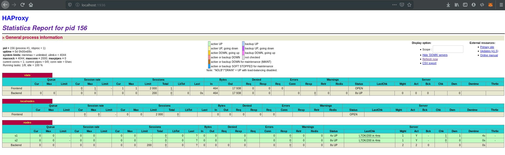
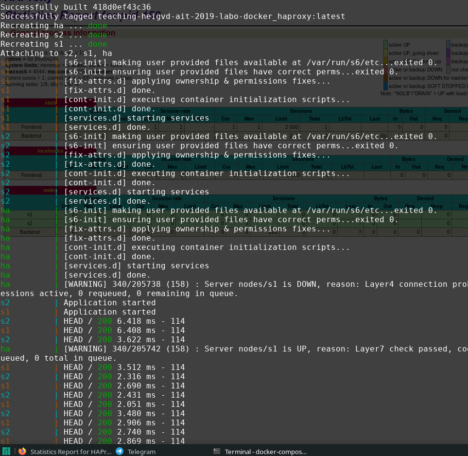
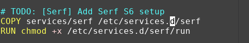
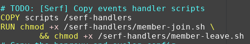
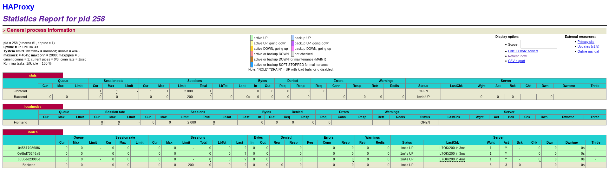
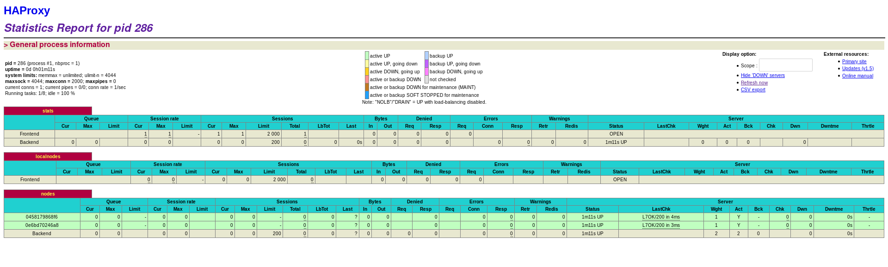

# Report for Lab4 AIT
### Authors: Mickael Bonjour & Miguel Gouveia
### Link to repository : https://github.com/mbonjour/Teaching-HEIGVD-AIT-2019-Labo-Docker

## Table of contents

## Introduction
In this lab we will se how to do an infrastructure which can scale out dynamically when we detect a new node or a node will go down. We will use different new technologies to us in this lab. It's useful to see these in action in such a manner.
## Task 0
### M1
Well not for the case described here. Because when people will connect in mass at Black Friday it will probably crash. And with this obscure bug that hasn't been fixed yet, the servers can crash without any charge. If it's the case nothing can restart the servers directly so there will be so awfully long downtimes.
### M2
We need to add a environment variable to the docker image of HAProxy (needed to know where the requests can be forwarded).That's done in the docker-compose.yml file in the environment section of ha image. And we need to add a web container to the docker-compose, the name of this container will be used by ha to forward the requests accordingly to the balancing strategy. So with these modifications we need to restart all the infrastructure and wait it's up to use it again.
### M3
We need a system where we can add/remove web servers and these can inform haproxy that they're here to respond to some HTTP requests. TO resolve the problem of crashing/overheating servers we need something to monitor the web servers and shutdowns/restart it when needed.
### M4
Like we said on M3, a system where the nodes inform the proxy of their presence and their capacities.
### M5
No we don't actually have the ability to perform these actions, maybe we can try with some shared volume where all the logs are created and one central container check the logs of all nodes and acts in consequences of the different logs seen.
### M6
When we add a web server nodes, we need to add the new node in the file haproxy.cfg and launch again the script for add the node. To make the configuration more dynamic, we need to use the Runtime API of HAProxy.
### Image of the nodes

### URL Repository
https://github.com/mbonjour/Teaching-HEIGVD-AIT-2019-Labo-Docker
## Task 1
### Image
The screenshot asked for in deliverables :


And in this image we can well see the s6 init who start the processes :


### Difficulties and resume
We didn't have any difficulties doing this task. This task is made to implement the s6 processor supervisor. Docker work with one main process, this main process can start other process but it is responsible for managing all processes that it starts. As main process we will start a little process "init", if another process stop, it doesn't stop the container. We will add a supervisor S6 who will manage the process. This supervisor will permit to run multiple processes in a container and permit us to restart a process when it stops with s6 supervisor. 

More details on : https://docs.docker.com/config/containers/multi-service_container/

## Task 2
### Configuration for serf process to s6 (both images)

### Logs
See the Task2 folder in the logs folder.
### Answer to given problematic of misconception
The problem is that we indicate at the nodes to join the nodes "ha". It works only if "ha" is up when the other nodes come. We would like everyone to be able to join independently.
### Serf
Serf establish communication between the nodes of a cluster. The nodes will inform about their states and inform about the states of the others in the cluster. Serf detec whan a node go offline or online.
There are other solutions for solving our situation, for exemple Consul who work with the gossip protocol of serf, but allow more options.
## Task 3
### Copying serf handlers

### Deliverables
For this task, all the deliverables will be on the logs folder. But I would just like to mention that we didn't have any problems of networks like mentioned. The nodes seems well connected and the joins scripts were triggered. That's because we used docker-compose.
## Task 4
### 1.
### Copy template

### Log of first haproxy conf
in logs, the file logConfHaproxy 
For the final manipulation I just modified the member-join.sh script to concatenate the configs created. So I had the resulting logs:
```
Container f59b51d037dd has joined the Serf cluster with the following IP address: 192.168.42.42
Container 2462b0f1ed4a has joined the Serf cluster with the following IP address: 192.168.42.22
Container 92c1a21662cb has joined the Serf cluster with the following IP address: 192.168.42.11
```
### Docker image layers
For the examples given, I will say the first example is better, because if one of the command change maybe not all will be relaunched, if it's command 3 none will be launched again, if it's command 2 we need to start command 3 again after it. In the second case if we change either of the command, all the commands will be launched again.

This can be explained by the way docker handles the dockerfile. It's because each command creates a layer of the result command of the image and these layers are saved. This is why docker is faster if the first commands are not changed, in fact these layers are reused if it's not changed. 
#### Squashing
Option exists in the docker daemon, it's in an experimental state but it's interesting to se this. Squashing is the way docker remove layers that are useless. So docker maybe just save the last layer which contain the last version of the image. This way the explained process previously will not work properly.

#### Flatenning
The command used to flatten a docker container is 

```docker export <CONTAINER ID> | docker import - some-image-name:latest```

### 2.
This can be done by regrouping all the common commands at the beginning of the Dockerfile. This way the first layers of the images will be the same and only the last layers will be different. So the build of the second image will be faster because some layers can be reused.

### 3.
As mentioned I've changed the shell script to be more concise and less painful to do this.
All the files are in the appropriate logs folder

### 4.
I think I resolved one of the problems because at first we regenerate the entire file at each join. But we will have a problem when starting a few nodes, because we can't generate multiple lines with differents servers.

## Task 5
We've not seen any remove all the servers in any of the files.
We've put all the neccessary logs in the relevant folder.
## Task 6
### Small experimentations
We have put 3 nodes (so strating 3 times the webapp image) and we've gone with this start page of HA :

With the following docker ps file (see in logs/task6/docker_ps_logs_3nodes) :
```
CONTAINER ID        IMAGE               COMMAND             CREATED             STATUS              PORTS                                                                                    NAMES
0e6bd70246a8        webapp              "/init"             5 minutes ago       Up 5 minutes        3000/tcp, 7373/tcp, 7946/tcp                                                             s3
8350ee239c8e        webapp              "/init"             5 minutes ago       Up 5 minutes        3000/tcp, 7373/tcp, 7946/tcp                                                             s2
0458179868f6        webapp              "/init"             7 minutes ago       Up 7 minutes        3000/tcp, 7373/tcp, 7946/tcp                                                             s1
48bef3f0011e        ha                  "/init"             8 minutes ago       Up 8 minutes        0.0.0.0:80->80/tcp, 7373/tcp, 0.0.0.0:1936->1936/tcp, 0.0.0.0:9999->9999/tcp, 7946/tcp   ha
```
If we run the command `docker stop s2` we have this start page :

With the following docker ps file (see in logs/task6/docker_ps_logs_2nodes) :
```
CONTAINER ID        IMAGE               COMMAND             CREATED             STATUS              PORTS                                                                                    NAMES
0e6bd70246a8        webapp              "/init"             10 minutes ago      Up 10 minutes       3000/tcp, 7373/tcp, 7946/tcp                                                             s3
0458179868f6        webapp              "/init"             11 minutes ago      Up 11 minutes       3000/tcp, 7373/tcp, 7946/tcp                                                             s1
48bef3f0011e        ha                  "/init"             12 minutes ago      Up 12 minutes       0.0.0.0:80->80/tcp, 7373/tcp, 0.0.0.0:1936->1936/tcp, 0.0.0.0:9999->9999/tcp, 7946/tcp   ha
```
### Feelings
I think this solution is complete, in fact it's really good to see the nodes updating like that when stoping/adding. Maybe it needs improvement of the haproxy restart because we see that it takes some time to restart it. But well great solution proposed here, I'm impressed of what we are capable of automating.
## Difficulties
No real difficulties seen in doing these tasks, exept for the questions because there's some really difficult questions.
## Conclusion
This lab presents us a way to do a dynamic system of reverse proxy with HaProxy. it's really good and complete. We can see the configurations change on the go and the nodes appearing/disapearing. We can improve the solution but it's a base I think we can reuse to do some system that need really good availability !
